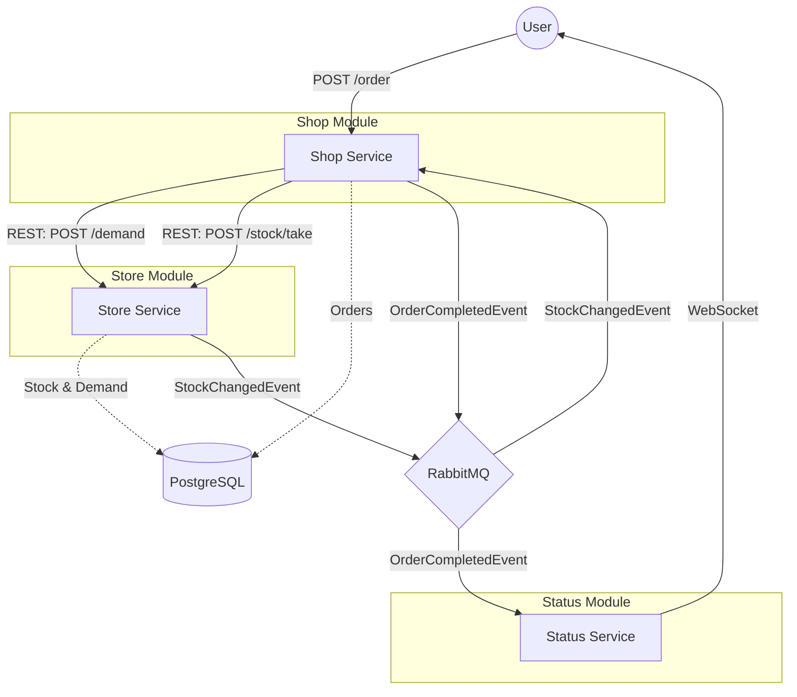

# Online Store

An online store system with microservices for orders, stock management, and status notifications.

## Architecture Diagram

The following Mermaid diagram illustrates the interactions between components:

## Shell Scripts Reference

The project root contains several utility scripts for environment management and testing:

| Script | Description |
|---|---|
| `start.sh` | Cleans Docker volumes and images, then starts the environment with `docker compose up`. Opens the status page at `http://localhost:8083`. |
| `stop.sh` | Stops and removes Docker containers, volumes, and orphans. |
| `restart.sh` | Runs `stop.sh` followed by `start.sh`. |
| `rebuild.sh` | Performs a clean rebuild of the Docker images and then runs `start.sh`. |
| `test.sh` | An integration test script using `curl` to verify order fulfillment and stock/demand updates. |
| `test-deficit.sh` | A specialized test script verifying that pending orders are automatically fulfilled when stock is added in multiple batches, handling deficits correctly. |
